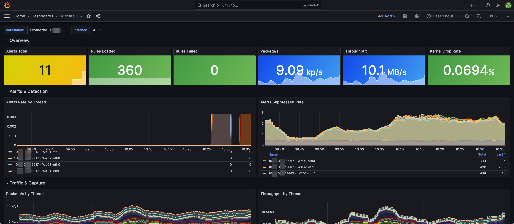

# Suricata Helm Chart

Helm chart for deploying [Suricata](https://suricata.io) as a DaemonSet on Kubernetes, with built-in Prometheus metrics exporter and Grafana dashboard.

## Features

- DaemonSet deployment with host networking for packet capture
- Unix socket-based Prometheus exporter ([suricata_exporter](https://github.com/corelight/suricata_exporter))
- PodMonitor for Prometheus Operator integration
- Pre-configured detection rules (SQL injection, XSS, path traversal, command injection, scanner detection, SSH brute force, port scan, DNS tunnel, cryptomining, C2, Kubernetes-specific threats)
- Eve log output to stdout or Redis
- Grafana dashboard included

## Prerequisites

- Kubernetes 1.19+
- Helm 3
- (Optional) Prometheus Operator for PodMonitor
- You need to build the [suricata_exporter](https://github.com/corelight/suricata_exporter) image yourself as no public image is available

## Install

```bash
helm install suricata ./charts/suricata \
  -n suricata --create-namespace \
  --set exporter.image.repository=your-registry/suricata-exporter \
  --set exporter.image.tag=latest
```

## Configuration

| Parameter | Description | Default |
|---|---|---|
| `image.repository` | Suricata image | `jasonish/suricata` |
| `image.tag` | Suricata image tag | `8.0.1` |
| `interface` | Network interface to monitor | `eth0` |
| `hostNetwork` | Enable host networking | `true` |
| `nodeSelector` | Node selector | `{}` |
| `tolerations` | Pod tolerations | `[{operator: Exists}]` |
| `resources` | Suricata container resources | 500m-2000m CPU, 1-4Gi memory |
| `evelog.output` | Eve log output (`stdout` or `redis`) | `stdout` |
| `evelog.redis.*` | Redis output configuration | see values.yaml |
| `exporter.enabled` | Enable Prometheus exporter | `true` |
| `exporter.image.repository` | Exporter image | `your-registry/suricata-exporter` |
| `exporter.image.tag` | Exporter image tag | `latest` |
| `exporter.port` | Metrics port | `9917` |
| `exporter.resources` | Exporter container resources | 50m-200m CPU, 32-128Mi memory |
| `vars.homeNet` | Suricata HOME_NET variable | `[192.168.0.0/16,10.0.0.0/8,172.16.0.0/12]` |
| `rules` | Custom Suricata rules | see values.yaml |

## Architecture

The chart deploys a DaemonSet with two containers per pod:

1. **suricata** — runs in privileged mode with `NET_ADMIN` and `SYS_NICE` capabilities for raw packet capture via `af-packet`
2. **suricata-exporter** — connects to Suricata via Unix socket (`/suricata-socket/suricata-command.socket`) to collect stats and expose Prometheus metrics on port 9917

The two containers share the socket directory via a hostPath volume at `/var/run/suricata-socket`.

## Grafana Dashboard

Import `dashboards/grafana-dashboard.json` into Grafana for a pre-built Suricata monitoring dashboard.



## License

Apache License 2.0
